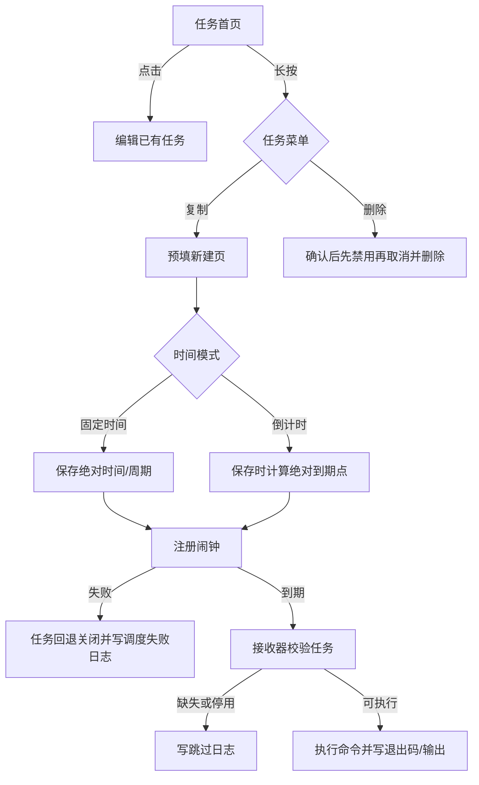

## 0. 术语约定

| 术语 | 定义 | 防冲突结论 |
| --- | --- | --- |
| 固定时间 | 沿用现有单次日期时间或每周指定星期的执行方式 | 不改变现有任务的含义，旧数据迁移后均为固定时间。 |
| 倒计时 | 保存或重新启用任务时开始的一次性延迟执行 | 输入为小时和分钟，至少 1 分钟；不等同于循环间隔，也不允许再选执行周期。 |
| 复制任务 | 从原任务生成未保存的新建草稿并进入编辑页 | 不直接插入数据库、不立即注册重复闹钟，用户保存后才生效。 |
| 执行日志 | 应用实际观测到的调度、派发与命令执行事件 | 不宣称能证明 Android 从未唤醒应用的系统级事件。 |

## 1. 决策与约束

### 需求摘要

首页任务行支持长按菜单，菜单提供复制与删除；新增/编辑页的执行时间可选固定时间或倒计时；日志页补齐调度失败、任务被跳过、命令无法启动、超时和非零退出等信息，并展示触发来源、退出码和完整输出。

成功标准：

- 点击任务仍进入编辑，长按才打开菜单；删除必须二次确认。
- 复制进入预填的新建页，副本没有原任务 id，保存前不创建任务、不调度。
- 固定时间兼容旧数据；倒计时保存或从关闭切回启用时重新开始，设备重启不会从头计时；一次性任务完成或过期恢复后自动关闭。
- 应用能观测到的失败都形成日志；日志不再只显示“成功/失败 + 一行输出”。

明确不做：

- 不把倒计时做成循环间隔，不允许倒计时与每周周期同时存在。
- 不引入常驻服务、后台轮询、网络上报或无障碍能力。
- 不通过破坏性迁移清空旧任务或旧日志。
- 不增加“验证命令副作用是否真的发生”的通用规则；Shell 返回 0 只表示进程正常返回。
- 不伪造 Android 未投递闹钟时的即时日志；该情况只有应用再次运行后才能做诊断，暂不自动推断为失败。

### 关键决策

- `TaskEntity.triggerAt` 继续表示下一次绝对触发时间；新增调度模式与倒计时长度。倒计时保存时使用溢出安全的加法把“当前时间 + 时长”写入 `triggerAt`，因此重启恢复沿用同一到期点。
- 旧任务迁移后模式固定为 `FIXED`，字段使用明确默认值，数据库从 v1 升到 v2，禁止 destructive fallback。
- 执行器返回独立的命令结果值，不再直接构造数据库日志实体；调用方补充触发来源和阶段后持久化，避免 UI、调度器和 Shell 细节互相耦合。
- 日志保留旧记录，并增加来源、阶段、状态、退出码、任务名快照与命令快照。旧记录来源为 `LEGACY`，退出码和快照允许为空，不能用当前任务信息反填历史。
- 调度失败统一把任务回退为关闭状态，避免首页显示启用但实际没有闹钟。停用或删除时先让数据库状态不可执行，再尝试取消平台闹钟。
- 一次性任务由存储层原子领取：只有成功把 `enabled` 从 true 改为 false 的闹钟处理才能执行命令，重复投递只能形成跳过结果。
- 首页菜单、时间模式选择和日志详情沿用当前深色配色、圆角、描边、字体与间距组件。现有风格已足以约束交互，因此本 feature 不新增参考图。

### 方案深度

候选一是只在 UI 上显示更多提示；候选二是把失败事实写入持久化日志。本场景属于长期维护且用户直接依赖的执行可信度能力，选择候选二。未采用“完整执行尝试状态机”，因为系统未唤醒时应用没有运行机会，单机本地状态机也不能在事发当刻形成真实证据；本次先覆盖应用能够确定观测的失败，不用推断填补事实空白。

### 风险、依赖与证据计划

- 数据迁移风险最高：以 Room 显式 Migration 和旧数据迁移测试证明，不允许删库重建。
- 倒计时重算时机容易歧义：保存和关闭后重新启用会重算；开机恢复只恢复原到期点。
- 日志容易误报成功：界面显示退出码与阶段，文案明确“Shell 返回 0”的含义。
- 命令输出可能超过进程管道缓冲区：执行器必须在进程运行期间持续读取合并后的 stdout/stderr，超时也保留已读取内容，不能等进程结束后才开始读取。
- 关键假设：倒计时以墙上时间保存和注册；用户手动修改系统时间会改变剩余时长。本轮先与现有 `RTC_WAKEUP` 语义保持一致，需由用户在整体 review 时确认。
- 当前环境缺少 Java/JAVA_HOME，构建与测试基线暂不可执行；恢复后必须运行单测、迁移测试和 Debug 构建。
- 交付物包括调度模式模型、数据库迁移、任务操作编排、首页长按菜单、编辑表单、日志模型与日志详情界面、自动化测试。
- 禁止新增调试输出、临时 TODO/FIXME、注释掉代码、吞错与无用 import。

## 2. 名词与编排

### 2.1 名词层

**现状**：`TaskEntity` 只有绝对 `triggerAt` 与 `repeatDays`；`TaskSchedule` 只区分单次和每周重复。`ExecutionLogEntity` 只有成功布尔值、耗时与输出，`CommandExecutor` 直接返回持久化实体。

**变化**：

- 任务增加 `scheduleMode` 与 `countdownDurationMillis`。约束为：
  - `FIXED`：`countdownDurationMillis = 0`，可选择单次或每周周期；只有无周期的单次固定时间要求晚于当前时间。
  - `COUNTDOWN`：`countdownDurationMillis >= 60_000`，`repeatDays` 必须为空。启用时 `triggerAt` 是计算出的绝对到期点；关闭时固定为哨兵值 0，仅保留倒计时时长配置。
- 命令执行结果包含耗时、输出、可空退出码与失败种类；日志再补充任务 id、可空任务名/命令快照、来源、阶段和状态。
- 日志来源为 `MANUAL`、`ALARM`、`BOOT_RECOVERY`、`USER_ACTION`、`LEGACY`；阶段为 `SCHEDULING`、`DISPATCH`、`EXECUTION`；状态为 `SUCCEEDED`、`FAILED`、`SKIPPED`。
- 日志持久化 `reasonCode`，最小集合为 `NONE`、`NON_ZERO_EXIT`、`PROCESS_START_FAILED`、`TIMEOUT`、`EXACT_ALARM_DENIED`、`ALARM_MANAGER_UNAVAILABLE`、`SCHEDULE_EXCEPTION`、`CANCEL_FAILED`、`TASK_MISSING`、`TASK_DISABLED`、`DUPLICATE_DELIVERY`、`EXPIRED_BEFORE_RECOVERY`。界面不得靠解析中文输出判断失败类型。
- 字段不变量：
  - `SUCCEEDED` 只用于命令阶段；新记录要求退出码为 0，`LEGACY` 旧记录因历史上未保存退出码而允许为空。
  - `FAILED` 可用于调度或执行；平台未启动进程、超时和旧记录允许 `exitCode = null`。
  - `SKIPPED` 表示应用已观察到任务缺失、停用或开机恢复时已经过期，不等同于推断系统漏投闹钟。
  - 旧成功/失败日志分别迁移为 `SUCCEEDED/FAILED + EXECUTION + LEGACY`；`exitCode/taskNameSnapshot/commandSnapshot` 均为空，展示时使用“历史记录/信息未记录”。
- 复制结果是 `id = 0` 的任务草稿，名称追加“副本”，保留命令、Root 与时间配置，但不继承启用状态。保存按钮显示“保存副本”，保存后默认关闭；倒计时只保留时长，不沿用原绝对到期点。
- 可替换接口边界：
  - `TaskStore` 负责任务与日志持久化，提供一次性任务原子领取；数据库异常向上返回。
  - `TaskScheduler` 的 schedule/cancel 返回成功或带原因的失败，不能把 AlarmManager 缺失或异常当成功。
  - `CommandRunner` 返回结构化结果，不写数据库；运行期间持续排空输出，超时返回部分输出。
  - `Clock` 提供当前毫秒，所有倒计时测试使用注入时钟。
  - `TaskOperations` 统一承接保存、启停、删除、立即执行、闹钟到达与开机恢复；ViewModel、Receiver 和 BootReceiver 只做薄适配。复制是纯草稿转换，不进入持久化 service。
- `TaskOperations` 最小入口与错误模式：
  - `save(task)`：返回已保存任务或失败原因。
  - `setEnabled(taskId, enabled)`：返回最终持久状态；倒计时只在 false→true 时计算到期点。
  - `delete(taskId)`：返回删除结果及取消警告。
  - `executeNow(taskId)`、`handleAlarm(taskId)`：返回结构化执行事件；后者对一次性任务先原子领取。
  - `restoreOnBoot()`：返回恢复数量、跳过数量与失败列表。
  - 操作结果可同时含主结果和可见警告；平台、数据库或日志失败不转换成成功。

### 2.2 编排层

**现状**：`TaskViewModel` 分别调用仓库、调度器和执行器；保存调度失败只写临时状态消息。`TaskAlarmReceiver` 遇到任务缺失或停用会直接返回，开机恢复忽略调度结果。

**变化**：

- 保存启用任务时先规范化字段并持久化，再注册；调度失败后先把任务回退为关闭，再尝试写失败日志，最终向前台返回调度失败与可能的日志警告。保存关闭态倒计时令 `triggerAt = 0`，不开始计时。
- 关闭任务时先保存 `enabled = false`，再取消闹钟，最后记录取消失败；日志失败不能回滚关闭状态。删除时先禁用，再尝试取消，随后删除，最后记录取消失败；日志失败不能阻止删除。即使平台闹钟残留，接收器也因任务缺失而跳过命令。
- 重新启用倒计时任务时以当前时间重新计算到期点；调度失败则仍保持关闭。保存复制任务只创建关闭状态、`triggerAt = 0`，不注册闹钟。
- 定时接收器对任务缺失、停用、命令启动异常、超时与非零退出分别形成可读日志。
- 无周期的固定时间任务和倒计时任务在执行命令前原子领取为关闭；领取失败的重复投递写 `DUPLICATE_DELIVERY` 或对应跳过原因且不执行。领取成功后无论命令或日志结果如何都保持关闭。
- 每周固定时间任务保持启用并注册下一次；固定顺序是执行命令、尝试写执行日志、注册下一次，重排失败时先回退关闭再写调度失败。执行日志失败不跳过重排，重排失败也不覆盖真实命令结果。
- 开机恢复每周固定时间、未来单次固定时间与尚未到期的倒计时。开机发现一次性任务到期点已过时，先关闭任务，再尝试写 `BOOT_RECOVERY + DISPATCH + SKIPPED`，原因是 `EXPIRED_BEFORE_RECOVERY`；这只记录开机时真实观察到的状态。
- 手动执行与定时执行共用命令执行入口，但通过来源字段区分。

流程级约束：

- 保存、启停、复制、删除均通过 ViewModel 暴露的操作进入，不在 Composable 内复制领域逻辑。
- 日志写入失败必须显式暴露，不能吞错或递归写日志：前台操作通过状态消息报告，Receiver/BootReceiver 让异常进入系统错误通道。
- 安全状态优先于可观测性：关停、删除、调度失败回退和一次性领取完成后，即使日志写入失败也不撤销；测试必须覆盖此顺序。
- 菜单长按与普通点击互斥，开关点击不能触发编辑或长按菜单。
- 时间模式切换时清除不适用字段：切到倒计时清空周期并要求输入小时/分钟；切回固定时间恢复本次编辑中先前确认的固定时间，没有历史值时使用“当前时间 + 1 小时”的新建默认值，不能沿用倒计时计算出的日期。

### 2.3 挂载点清单

- 首页任务行手势入口：增加长按菜单，保留点击编辑和开关操作。
- 新建/编辑页时间区域：增加固定时间/倒计时选择及对应输入。
- 任务保存、启停与开机恢复入口：接入调度模式规范化和失败日志。
- 定时接收器与立即执行入口：接入来源、阶段、退出码和跳过日志。
- 全局与单任务日志页：展示新增日志信息和完整详情。

### 2.4 推进策略

1. 提取统一任务操作服务和可替换依赖，并用旧行为测试锁住现状。
2. 建立调度模式、命令结果与日志事件的稳定名词契约。
3. 启用 Room schema export 并完成无损迁移。
4. 接通固定时间、倒计时保存/启停/删除/开机恢复的统一编排。
5. 接通手动、定时、恢复和用户操作路径的失败日志与完整命令结果。
6. 增加首页长按菜单、关闭态复制草稿与删除确认。
7. 增加编辑页模式选择、倒计时输入与互斥校验。
8. 扩充日志列表和详情，覆盖空态、长输出、小屏与构建回归。

### 2.5 结构健康度与微重构

#### 评估

- `TaskViewModel` 目前同时编排保存、调度、删除和执行，继续直接增加日志分支会把平台调用与持久化策略集中到 UI 层。
- `TaskEditorScreen` 已接近文件上限，继续加入模式选择、倒计时解析和复制规则会混合表单、领域转换与弹窗。
- `ui/` 目录已有按页面拆分结构，新增一个时间模式组件与一个菜单组件不会形成无规则摊平。

#### 结论：微重构（拆职责）

- 搬什么：把任务保存/启停/执行的组合流程从 ViewModel 提取为可注入的任务操作服务；把草稿与任务的转换/校验移出页面文件。
- 搬到哪：领域编排放入独立 service，纯表单转换放入 UI model 文件；页面仍只接收状态和回调。
- 怎么验证行为不变：提取后为旧保存、启停、删除和立即执行路径补 service 测试，再跑现有 `TaskScheduleTest` 与构建；所有既有 ViewModel 行为入口保持可达。

## 3. 验收契约

### 关键场景

1. 短按任务行进入编辑；长按同一行出现复制/删除菜单；点击开关只改变启停状态。
2. 长按复制后进入预填新建页，副本名称有区分、id 为 0；返回不保存时数据库和闹钟均无新增，保存后副本默认关闭且倒计时尚未开始。
3. 长按删除后必须确认；确认后任务和闹钟消失，历史日志保留。
4. 旧数据库升级后原任务全部按固定时间工作；旧成功/失败日志映射为 `LEGACY` 来源且未知字段保持为空，包含已删除任务的日志仍可查看。
5. 固定时间任务继续支持单次和每周周期，保存后下次触发与当前规则一致。
6. 倒计时输入有效时，保存后的到期点等于保存时刻加时长；关闭后重新启用会重新开始，重启恢复不会重新开始；执行一次后无论命令结果如何都自动关闭。
7. 倒计时输入使用非负整数小时和 0..59 分钟，空值按 0 处理；合计小于 1 分钟、无周期的单次固定时间已过期、倒计时与周期同时存在或时长加法溢出时，保存被拒绝并显示明确原因；每周固定时间允许使用历史日期中的时分与星期。
8. 精确定时权限缺失、AlarmManager 不可用或注册异常时，首页显示错误且日志页出现调度失败记录。
9. 定时到达但任务缺失/停用时写跳过日志；命令无法启动、超时或非零退出时写失败日志并显示原因，可用时显示退出码。
10. 手动与定时执行在日志中能区分；成功项显示“Shell 返回 0”语义，长输出可展开查看而不是只保留首行。
11. 开机发现已过期的一次性任务时写恢复跳过日志并关闭；系统没有投递闹钟时不生成伪造的即时失败记录，界面和文档不声称本地日志能证明该系统事件。
12. 调度或重排失败后任务显示为关闭；取消失败后任务同样不可执行，删除后残留平台闹钟到达也只能形成跳过记录。
13. 同一个一次性闹钟重复投递时命令最多执行一次；日志写入失败不会阻止一次性关停、删除、调度失败回退或每周任务重排。
14. 命令持续输出超过管道缓冲区时不会因读取顺序而卡死；超时日志保留已经读取的 stdout/stderr。

### 明确不做的反向核对

- 不存在倒计时循环注册、倒计时与星期周期共存、破坏性迁移或后台轮询。
- 不存在直接复制入库并立即启用的隐藏操作。
- 不存在捕获异常后返回模拟成功、空输出冒充成功原因或日志写入失败被吞掉。

### Acceptance Coverage Matrix

| Scenario | Covered By Step | Evidence Type | Command / Action | Core? |
| --- | --- | --- | --- | --- |
| 长按菜单、复制与删除 | S6 | Compose 行为验证、截图 | 短按/长按/开关/确认删除 | yes |
| 固定时间兼容 | S2/S3/S4 | 单元测试、迁移测试 | 迁移旧任务并计算下次触发 | yes |
| 倒计时保存与恢复 | S2/S4 | 单元测试、接收器编排测试 | 保存、启停、执行、模拟重启 | yes |
| 调度与派发失败日志 | S4/S5 | service 测试、数据库断言 | 注入失败调度器和缺失任务 | yes |
| 命令结果详情 | S5/S8 | 单元测试、日志截图 | 成功/非零/异常/超时/长输出 | yes |
| 输入错误与互斥 | S7 | 单元测试、手工验证 | 小于 1 分钟、过期单次、周期冲突、溢出 | yes |
| 重复投递与错误顺序 | S4/S5 | service 并发/顺序测试 | 重复闹钟、日志写入失败、重排失败 | yes |
| 构建与回归 | S8 | 命令输出 | 单测、迁移测试、Debug 构建 | yes |

### DoD Contract

| ID | 要求 | 证据 | 阻塞级别 |
| --- | --- | --- | --- |
| DOD-DESIGN-001 | 设计与清单通过独立审查并由用户确认 | design review + owner approval | blocking |
| DOD-IMPL-001 | 清单步骤全部完成且数据库迁移保留旧数据 | checklist + migration evidence | blocking |
| DOD-REVIEW-001 | 代码审查无未解决阻塞项 | review report | blocking |
| DOD-QA-001 | 核心场景均有自动化或界面证据 | QA report | blocking |
| DOD-ACCEPT-001 | 验收逐项反查代码、数据库与界面 | acceptance report | blocking |

Validation Commands:

| ID | 命令 | 目的 | 核心性 | 失败处理 |
| --- | --- | --- | --- | --- |
| CMD-001 | `gradlew.bat testDebugUnitTest` | 调度、草稿转换与编排单测 | core | document-baseline |
| CMD-002 | `gradlew.bat connectedDebugAndroidTest` | Room 迁移与 Compose 行为验证 | core | document-environment |
| CMD-003 | `gradlew.bat assembleDebug` | Debug APK 编译 | core | document-baseline |

Room 迁移契约：

- 在提高数据库版本前启用 Room schema export，并从当前 v1 代码生成并提交真实 `1.json`；实现 v2 后提交 `2.json`。
- `AppContainer` 的 `databaseBuilder` 必须注册 `Migration(1, 2)`，禁止调用 destructive fallback。
- 迁移重建日志表时保留 id、taskId、时间、耗时和输出；旧 `success` 映射到新状态，未知来源和快照不伪造。
- `MigrationTestHelper` 必须创建 v1 数据库，插入固定/重复/停用任务、成功/失败日志及任务已删除后的孤立日志，执行迁移并校验完整 schema、行数、原字段、新字段默认值和孤立日志可查。
- 设备环境暂不可用可以记录环境阻塞，但迁移核心证据在 feature 完成前不可豁免。

Required Artifacts: design review、v1/v2 schema、显式 Migration、自动化测试输出、首页长按菜单截图、固定/倒计时编辑截图、丰富日志截图、代码 review、QA 与验收报告。

## 4. 与项目级架构文档的关系

项目当前没有 CONTEXT 或 ADR。本 feature 会形成“绝对触发点 + 调度模式配置”和“应用可观测日志边界”两个稳定约束；实现与验收通过后再判断是否需要用 `cs-domain` 补充 ADR，本阶段不提前创建。
