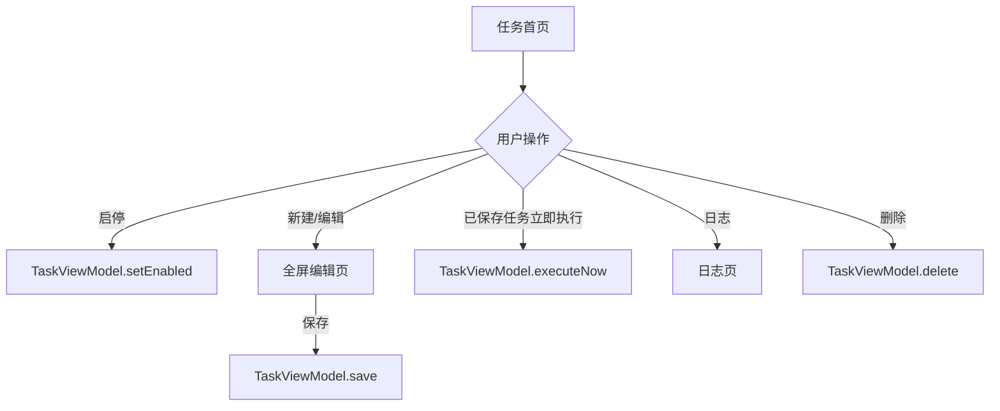

## 0. 术语约定

| 术语 | 定义 | 防冲突结论 |
| --- | --- | --- |
| 任务行 | 首页中对应一个 `TaskEntity` 的整行可操作展示 | 复用现有“任务”实体，不新增领域对象。 |
| 命令摘要 | 任务命令的首行、单行截断展示 | 仅为展示派生值，不持久化。 |
| 编辑页 | 新建与编辑任务共用的全屏 Compose 页面 | 取代当前弹窗式编辑器。 |

## 1. 决策与约束

### 需求摘要

完整保留任务管理、Root 状态、精确定时权限、立即执行、日志与调度链路，并复刻已确认的深色命令工具界面。成功标准是用户可在首页识别 Root、启用状态、时间、周期和命令摘要，并完成新建、编辑、启停、删除、立即执行和查看日志。

明确不做：不改变调度、Shell/Root 执行、数据库或权限逻辑；不引入后台服务、网络、动画库、图片资源、渐变、玻璃效果或额外 UI 依赖。

### 视觉依据

| 页面 | 唯一参考资产 | 画布 | 必须对照的可见规则 |
| --- | --- | --- | --- |
| 首页 | [home.png](references/home.png) | 864 × 1821 px | 深墨绿黑底、左对齐“任务”、Root 单行状态、三条分隔任务行、右侧开关、底部“日志 / ＋ 新建任务”。 |
| 新建/编辑 | [editor.png](references/editor.png) | 863 × 1823 px | 顶部返回/标题/保存，细分隔表单，等宽命令编辑区，Root 行、立即执行描边按钮与底部橙色保存按钮。新建态的测试按钮按本节契约禁用。 |

验收截图固定使用 412dp 宽 Android 设备、字体缩放 100%、深色模式；不实现手机外框或桌面背景。色板固定为背景 `#0C1211`、分隔面 `#171E1C`、主要文字 `#E8ECE7`、强调色 `#FF6B35`；标题使用系统无衬线，命令与输出使用等宽字。间距、分隔线、图标与开关的位置以参考资产逐项视觉对照，不能以“类似”替代。

### 决策、依赖与风险

- 新建与编辑使用全屏页面，以容纳多行命令与软键盘；任务用细分隔列表，不使用卡片。
- 日志使用同一色板与等宽输出文字；日志内容仍完全来自现有数据流。
- 未保存任务的“立即执行”固定为禁用：保留参考图中的描边按钮与图标，但使用低对比禁用色，并在其下显示“保存后可执行”。不触发命令、不写日志、不临时创建任务。编辑已有任务时按钮可用，调用既有立即执行并写入该任务日志。
- 走 Android/Compose 默认复杂度档位，无对外契约、并发或数据迁移偏离。
- 基线风险：`gradlew.bat testDebugUnitTest` 因环境缺少 Java/JAVA_HOME 无法启动；恢复环境前不能把它算作本 feature 的失败。

### 证据计划与清洁度

- 核心证据：Debug 单元测试与 APK 编译命令、静态代码审查、固定设备的首页/新建/日志截图与参考资产对照。
- 不新增调试输出、TODO/FIXME、注释掉代码或无用 import。
- Top 3 风险：参考图小屏适配、软键盘遮挡保存按钮、旧操作遗漏；分别以固定截图、`imePadding`/安全区与验收矩阵缓解。

## 2. 名词与编排

### 2.1 名词层

**现状**：`TaskEntity` 是唯一任务模型；`TaskViewModel` 提供任务流、保存、启停、立即执行、删除、日志和 Root 状态；`MainActivity` 内的组合函数同时承担主题、首页、行、日志及编辑弹窗。

**变化**：不改变 `TaskEntity` 或 `TaskViewModel` 语义。新增仅负责展示的任务行、首页顶栏、编辑页和日志视图；命令摘要与周期文字由现有字段派生。编辑页根据 `task.id > 0` 派生不可变的 `canExecuteNow`：新建态为 false、编辑态为 true。只有装配层持有 `TaskViewModel`；页面只接收不可变数据、状态文本和回调。Root 状态由装配层加载；精确定时授权返回时重新读取；保存/调度失败继续从 `statusMessage` 显示；日志页拥有日志 Flow 订阅。

```text
TaskTriggerScreen(tasks, rootStatus, statusMessage)
├── TaskListItem(task, callbacks)
├── TaskEditorScreen(task?, callbacks)
└── TaskLogsScreen(task, logs, callbacks)
// 来源：ui/MainActivity.kt TaskTriggerScreen
```

### 2.2 编排层



**现状**：首页以普通 `Column` 和弹窗聚合交互；列表直接调用既有 `TaskViewModel`。

**变化**：首页编排任务列表、状态和页面切换；编辑页保存或取消后返回首页。每个领域操作仍经同一 ViewModel 调用，异常信息保留在首页可见区域。新建态的立即执行按钮不接入执行入口；编辑态才调用 `TaskViewModel.executeNow`，执行记录写入已存在任务的日志。

流程级约束：UI 不复制调度、Root 检测或命令执行逻辑；保存成功通过任务 Flow 反映，立即执行结果通过日志事实反映；命令允许多行且不截断输入；无任务、未授权 Root、精确定时权限缺失和长文本都有明确展示。

### 2.3 挂载点清单

- `MainActivity` Compose 根内容：修改 — 挂入深色主题和页面导航状态。
- 任务首页“＋ 新建任务”入口：修改 — 进入编辑页。
- 每个任务行：修改 — 挂入启停、编辑、立即执行、日志和删除入口。
- Root/精确定时状态区域：修改 — 显示同一视觉系统的系统状态行。

### 2.4 推进策略

1. 静态结构：建立主题、首页列表和任务行。退出信号：固定设备截图可逐项对照首页参考资产。
2. 页面交互：接通新建、编辑、启停与删除。退出信号：固定设备截图可逐项对照编辑参考资产，且操作触达原有 ViewModel。
3. 执行与日志：新建态禁用立即执行并显示提示；接通已保存任务立即执行、删除确认和空/成功/失败日志。退出信号：这些状态均可观察。
4. 状态接入：接通任务、Root、权限和调度失败数据。退出信号：真实数据变化同步刷新，未伪造执行结果。
5. 小屏收尾：覆盖空态、长命令、软键盘、未授权和对比度。退出信号：验收矩阵都有固定截图或命令证据。

### 2.5 结构健康度与微重构

##### 评估

- 文件级 — `ui/MainActivity.kt` 182 行，混合主题、页面编排、任务行、日志、编辑器与校验六项职责；本次会在多个独立区域变更。
- 目录级 — `ui/` 现有 2 个同层文件；新增页面组件不会形成摊平目录。
- compound 检索未命中组件归属或目录组织约束。

##### 结论：微重构（拆文件）

- 搬什么：将首页、任务行、编辑页、日志页及主题从活动入口分离。
- 搬到哪：活动入口只负责装配；每个页面/共享组件保持单一 UI 职责。
- 行为不变怎么验证：ViewModel 操作签名不变，事件仍调用同一 ViewModel 方法，单测与编译在可用环境中通过。

## 3. 验收契约

### 关键场景

1. 有启用与停用任务时打开首页 → 显示名称、周期时间、命令摘要及开关状态；截图逐项对照首页参考资产。
2. 点击“＋ 新建任务” → 打开全屏编辑页，显示名称、时间、周期、命令、Root、禁用的立即执行和保存入口；截图逐项对照编辑参考资产。
3. 填入多行命令并保存 → 返回首页、任务摘要刷新，仍通过现有调度保存。
4. 点击已保存任务的开关、立即执行和删除 → 分别调用既有操作；删除须明确确认，立即执行不伪造成功状态。
5. 新建任务点击立即执行 → 按钮不可点击并显示“保存后可执行”；不执行命令、不写日志、不创建临时任务。
6. Root 不可用、精确定时未授权或无任务 → 显示可读状态/空态，不隐藏错误。
7. 长命令、小屏和软键盘 → 输入与保存仍可访问，无关键内容重叠。
8. 查看日志 → 分别展示空、成功、失败的时间、耗时和等宽命令输出。

### 明确不做的反向核对

- 不新增 `TaskEntity` 字段、Room 迁移、调度或命令执行分支。
- 不引入网络 API、前台服务、无障碍、悬浮窗、渐变或额外 UI 依赖。

### Acceptance Coverage Matrix

| Scenario | Covered By Step | Evidence Type | Command / Action | Core? |
| --- | --- | --- | --- | --- |
| 任务列表视觉与开关 | S1/S4 | 固定设备截图、代码审查 | 打开首页并切换任务，对照 `references/home.png` | yes |
| 新建与编辑表单 | S1/S2 | 固定设备截图、行为验证 | 新建任务后保存，对照 `references/editor.png` | yes |
| 多行命令与 Root | S2/S5 | 手工验证、截图 | 输入多行命令、开关 Root、打开键盘 | yes |
| 立即执行与结果 | S3 | 手工验证、日志截图 | 新建态验证禁用提示；对已保存任务立即执行 | yes |
| 删除与日志状态 | S2/S3 | 手工验证、截图 | 删除任务；查看空/成功/失败日志 | yes |
| 错误与小屏状态 | S4/S5 | 手工验证、截图 | 未授权/空任务/软键盘 | no |
| 单元与构建回归 | S5 | 命令输出 | `gradlew.bat testDebugUnitTest`、`gradlew.bat assembleDebug` | yes |

### DoD Contract

| ID | 要求 | 证据 | 阻塞级别 |
| --- | --- | --- | --- |
| DOD-DESIGN-001 | 设计与清单通过独立审查 | design review | blocking |
| DOD-IMPL-001 | 清单步骤全部完成 | checklist 与 diff | blocking |
| DOD-REVIEW-001 | 代码审查无未解决阻塞项 | review report | blocking |
| DOD-QA-001 | 核心场景有验证证据 | QA report | blocking |
| DOD-ACCEPT-001 | 验收完成 | acceptance report | blocking |

Validation Commands:

| ID | 命令 | 目的 | 核心性 | 失败处理 |
| --- | --- | --- | --- | --- |
| CMD-001 | `gradlew.bat testDebugUnitTest` | 单元测试回归 | core | document-baseline |
| CMD-002 | `gradlew.bat assembleDebug` | Debug APK 编译 | core | document-baseline |

Required Artifacts: design review、代码 review、QA、验收报告、命令输出，以及 412dp/100% 字体缩放的首页、新建、日志截图。

## 4. 与项目级架构文档的关系

本 feature 改动局限在 UI 层，不引入系统级名词、跨模块编排或稳定架构决策；验收后无需更新 CONTEXT 或 ADR。
